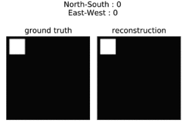

# dynamical-distentanglement
[](https://arxiv.org/abs/2002.06991)
[](./LICENSE)

---

This repository contains code for learning disentangled representations of dynamical environments.

Initially, this project was developed for the paper [Learning Group Structure and Disentangled Representations of Dynamical Environments](https://arxiv.org/abs/2002.06991), however this is **not** the official supporting code (which can be found [here](https://github.com/IndustAI/learning-group-structure))!  Instead, this repository provides a framework for extending this work to more complex environments and is provided as-is to support future work and, hopefully, be of general interest and use :smile:.

---

|   |  |  |
|:---:|:---:|:---:|
| (a) GridWorld | (b) 3DCars | (c) 3DShapes |

*Comparing ground truth with reconstructed images for the built-in dyanamical environements.  Note that each of these environments can be configured wuth additional generative factors, but we restrict these example to a few illustrative cases.*

## Overview

##### Representation learning

 We consider representation learning of dynamical environments to be the task of learning: (i) to encode static observations (i.e. images) in a latent space and (ii) how actions evolve this latent representation such that it remains faithful to the ground-truth in the observation space.  Our approach, as formalised in the above mentioned [paper](https://arxiv.org/abs/2002.06991), is to use spherical latent spaces (where observations are encoded as unit-norm n-dimensional vectors) and represent actions as unitary (i.e. norm-preserving) rotations.
 
Moreover, we aim to find not just a faithful representation of the environment, but a disentangled representation as defined by [Higgins et al. (2018)](https://arxiv.org/abs/1812.02230).  At a high level, a distentangled representation is one where the generative factors of the environment (e.g. 'North-South' and 'East-West' in (a) GridWorld, 'wall_hue' and 'orientation' in (c) 3DShapes, etc.) can can be independently identified and modified in the latent space encoding.  [Our work](https://arxiv.org/abs/2002.06991) proposed a regularisation that, when applied to the learned representations of actions, encourages this disentanglement.
 
##### This project

The goal of this project is to provide a framework for modelling the systems described above that is both compact (everything can be configured, initialised, trained and tested in only a few lines of code) whilst still being tractable and extendable.  To this end, the examples above require only four lines of code.

```python
    dataset = GridWorld(...) # or Cars3D(...) or Shapes3D(…)
    rep_learner = DynamicRepresentationLearner(dataset, ...)
    rep_learner.train(...)
    rep_learner.test(...)
```
    
(though you'll have to turn the images returned from ``.test(...)`` into a GIF yourself...).

## Getting started

##### Requirements

The underlying neural networks requrie [PyTorch](https://pytorch.org/).  For the three environments provided, 3DCars and 3DShapes require [PIL](http://www.pythonware.com/products/pil/) and [h5py](https://www.h5py.org/), respectively, to load the images (GridWorld has no additional requirements).

Otherwise, all other required packages - numpy, matplotlib, seaborn if you want pretty plots etc - are standard, however full details of the environment used locally during testing are provided in [environment.yml](environment.yml).

##### Set-up

It should be as simple as cloning the repo.  However, the data for 3DCars and 3DShapes is not included by default.  These datasets are publicly available (original papers can be found [here](https://papers.nips.cc/paper/5845-deep-visual-analogy-making) and [here](https://arxiv.org/abs/1802.05983), respectively).  For simplicity, they can be downloaded into this project run the relavant bash scripts found in the [scripts](scripts) folder.

    >>> git clone --recursive https://github.com/tomdbar/dynamical-disentanglement
    >>> cd dynamical-disentanglement
    >>> scripts/download_3dcars.sh
    >>> scripts/download_3dshapes.sh

##### Where to start? [](https://colab.research.google.com/github/tomdbar/dynamical-disentanglement/blob/master/notebooks/representation-learning.ipynb)

In lieu of an extended discussion here, two notebooks are provided to introduce the project.
- [introduction.ipynb](notebooks/introduction.ipynb): Introduces the key components of the repository and gives a few simple examples of how they work.
- [representation-learning.ipynb](notebooks/representation-learning.ipynb): Uses the project to learn representations of dynamical environments.  This notebook can be run either locally or on [Colab](https://colab.research.google.com/github/tomdbar/dynamical-disentanglement/blob/master/notebooks/representation-learning.ipynb) (where it will first import and set-up the project).
